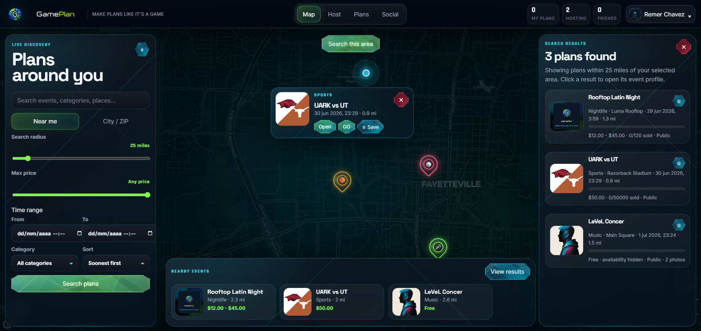
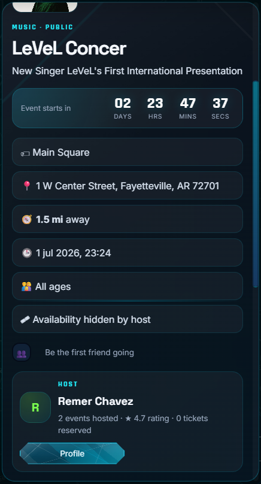
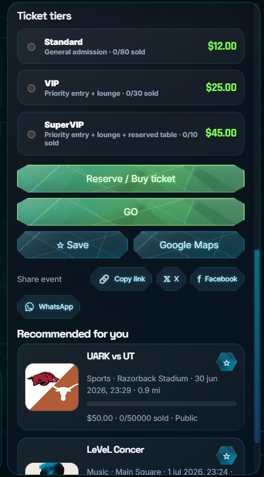
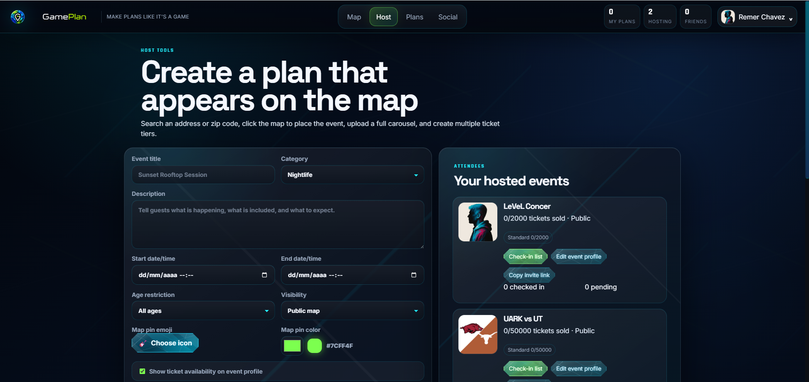
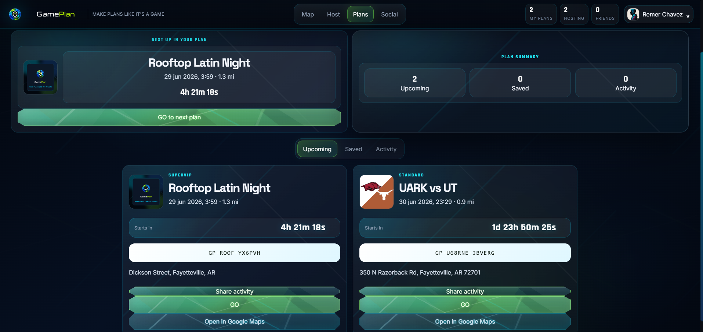
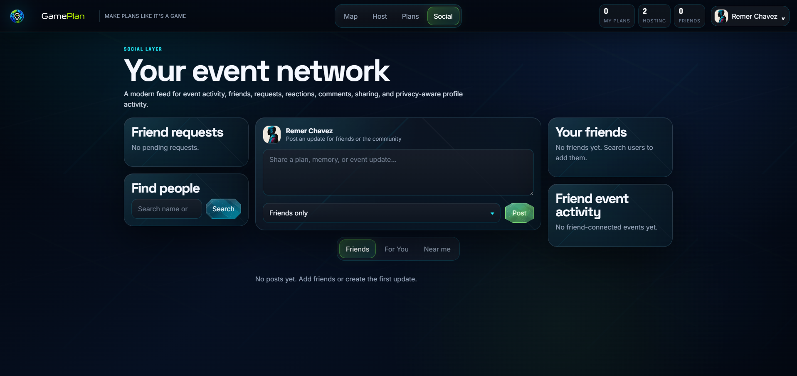
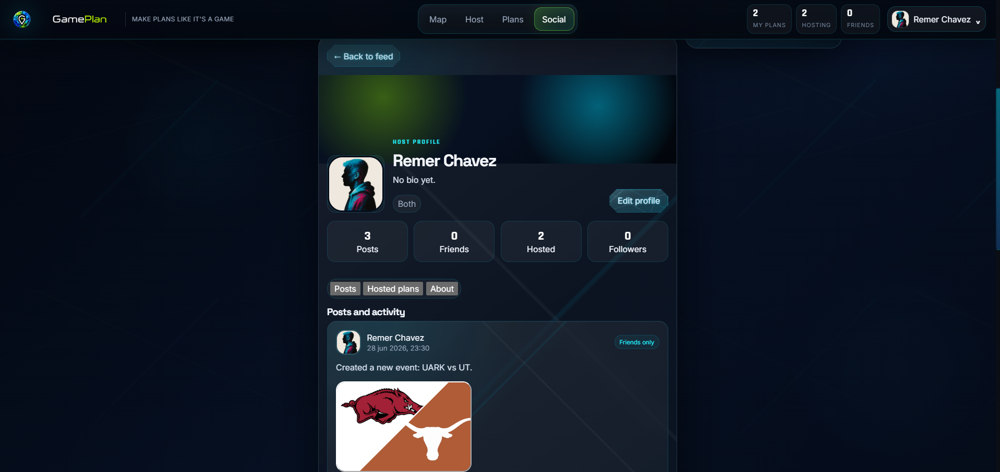

<p align="center">
  
</p>

# GamePlan

GamePlan is a full-stack portfolio/demo web application for discovering, creating, reserving, and sharing real-world plans on an interactive map. It combines event discovery, host tools, ticket tiers, saved plans, social activity, profile controls, and Dark/Light appearance modes in one map-first experience.

**License:** All rights reserved. Portfolio/demo use only.

## Project context

GamePlan was built as a full-stack MVP to demonstrate product design, frontend architecture, backend API design, authentication, local persistence, map interaction, responsive UI, and polished visual design. The interface uses a premium holographic map style with Dark Mode as the default and Light Mode for daytime use.

This repository is intended for portfolio review, technical discussion, and demo use. It is not a production event-ticketing platform.

## Demo showcase

### Map discovery



### Event profile overview



### Tickets and reservations



### Host tools



### Plans wallet



### Social network



### Social profile



## Features

- Account registration and login
- Signed HTTP-only session cookies
- Password hashing with bcrypt
- CSRF protection for authenticated write actions
- Login and registration rate limiting
- Interactive MapLibre GL event map
- Dark and Light appearance modes saved in account settings
- Search by current location, city, ZIP code, radius, price, category, and time range
- Custom holographic event markers with category identity
- Floating map event preview cards
- Event profile panels with image gallery, details, tickets, host card, sharing, and navigation
- Optional location name field for venue or place names
- Host event creation with map-based location selection
- Multi-image event uploads and image ordering
- Ticket tiers with price, availability, capacity, and descriptions
- Ticket wallet with upcoming, saved, and activity views
- Host check-in list and ticket validation flow
- Friend search and friend request workflow
- Social feed with posts, shared event cards, reactions, comments, and shares
- User profile editor with avatar, banner, bio, website, privacy, locator color, and appearance settings
- Responsive mobile shell with bottom navigation and mobile-safe map/profile layouts
- Local JSON database and local uploads for easy demo setup
- Smoke test script for core API and workflow validation

## Tech stack

- Node.js
- Express
- Vanilla JavaScript
- MapLibre GL JS
- HTML/CSS
- Local JSON persistence
- Local file uploads with Multer
- bcryptjs
- Zod
- Helmet

## Project structure

```txt
public/
  css/                  Modular stylesheet sections
  js/                   Modular browser scripts
  assets/               Logo and UI assets
    gameplan-default.png
    gameplan-logo-title-banner.png
    gameplan-icon-notitle.png
    gameplan-wordmark-darktext.png
    gameplan-wordmark-regular.png
  index.html            App shell
docs/
  showcase/             README demo screenshots
data/
  gameplan.db.json      Demo/local database included for this portfolio upload
uploads/
  user-uploaded-files/  Included upload placeholder for portfolio/demo review
scripts/
  smoke-test.mjs        API workflow smoke test
server.mjs              Express server and API routes
```

## Run locally

```powershell
npm install
npm start
```

Open:

```txt
http://localhost:5173
```

## Demo accounts

```txt
Email: demo@gameplan.local
Password: Demo1234!

Email: host@gameplan.local
Password: Host1234!
```

## Environment variables

The repository includes `.env` for the official portfolio/demo upload.

```txt
PORT=5173
SESSION_SECRET=change-this-before-deployment
NODE_ENV=development
OPENROUTE_SERVICE_API_KEY=
```

`OPENROUTE_SERVICE_API_KEY` is optional. Without it, GamePlan uses a straight-line route preview fallback.

## Test

```powershell
npm test
```

The smoke test validates authentication, CSRF, profile updates, event creation, ticket tiers, friend requests, host follows, feed activity, saved events, navigation fallback, ticket purchase, wallet views, and host check-in.

## Production considerations

Before using this with real users, replace local JSON storage with PostgreSQL/PostGIS, move uploads to object storage, add email verification, password reset, production session storage, audit logs, backups, image moderation, payment processing, webhook verification, monitoring, and a production deployment pipeline.

## License

All rights reserved. Portfolio/demo use only.

<p align="center">
  
</p>
